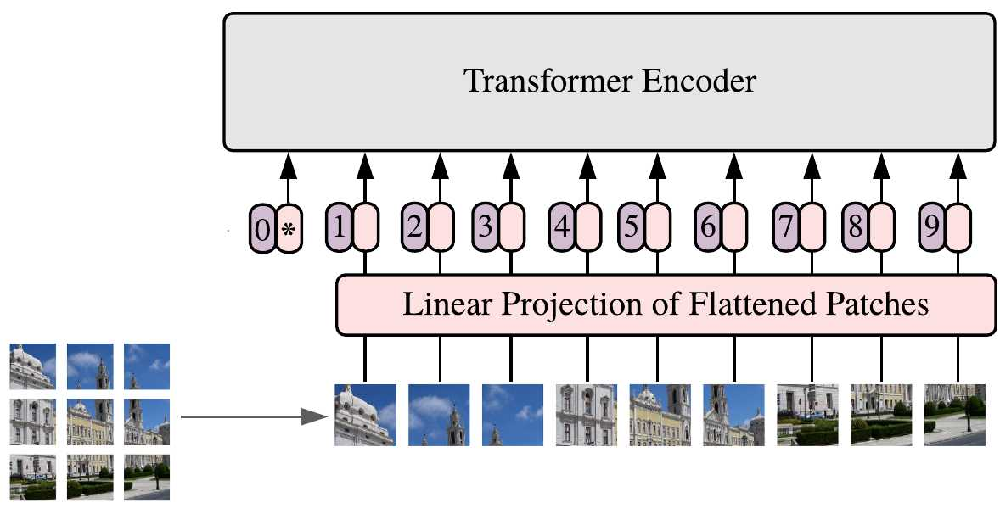
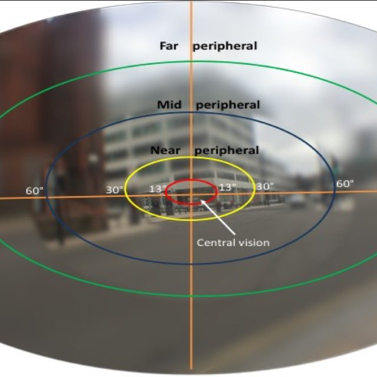

## Eye grid

When performing object detection image is partitioned into smaller grids. To each grid is then performed same operation (eg. convolution or attention).

 *Example how transformer partitions patches*

*Example how human perform partitioning in eyes.*

This repo is an attempt to mimic human partitioning of input image. My hypothesis is that this method can substantially reduce number of dense convolutions in first layer of neural network.